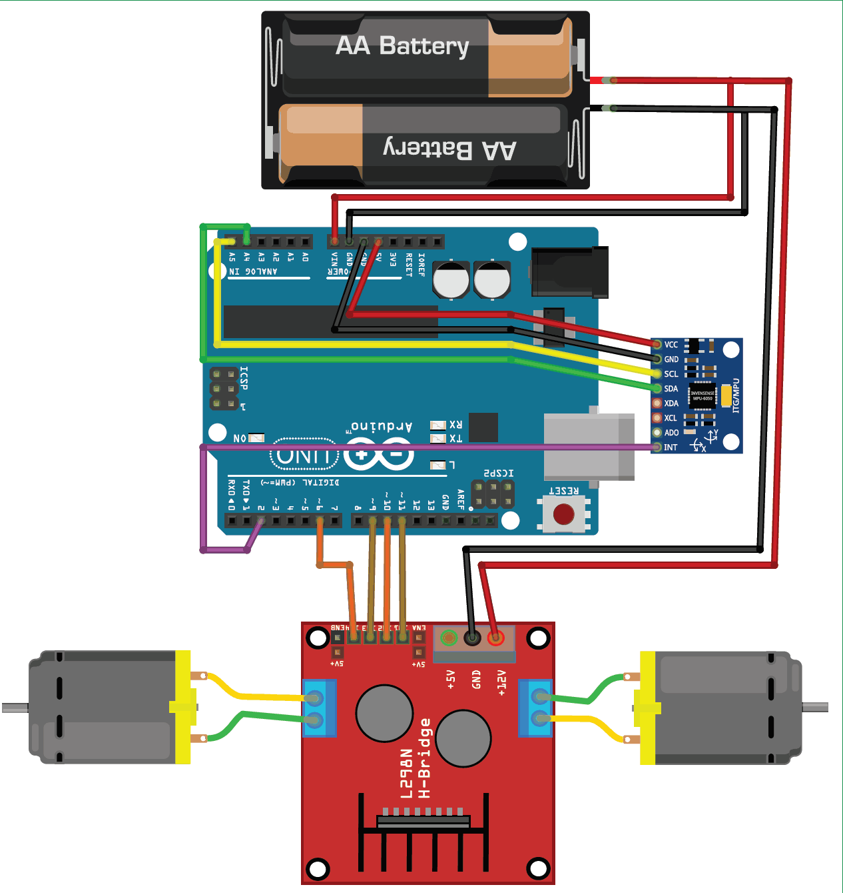

# Self-Balancing-Robot-Tetra-Sparks

## Description
This project implements a **Self-Balancing Robot** using an **MPU6050** accelerometer/gyroscope sensor, **PID control**, and an **Arduino-based motor controller**. The robot continuously adjusts its motor speeds to maintain an upright position by analyzing the tilt angle and applying necessary corrections.

## Components Used
- **Arduino Uno** 
- **MPU6050** (Accelerometer & Gyroscope Sensor)
- **Motor Driver (L298N)**
- **DC Motors** (x2)
- **Wheels** (x2)
- **Battery Pack** (Li-ion or similar, 7.4V to 12V)
- **Jumper Wires**

## Circuit Diagram


## Installation & Setup
1. Clone the repository:
   ```bash
   git clone https://github.com/YourOrganization/Batch20_GroupNo.git
   ```
2. Install the necessary libraries:
   - [PID_v1](https://github.com/br3ttb/Arduino-PID-Library)
   - [I2Cdev](https://github.com/jrowberg/i2cdevlib)
   - [MPU6050](https://github.com/jrowberg/i2cdevlib/tree/master/Arduino/MPU6050)
3. Upload the provided **Arduino Code** to your microcontroller.
4. Connect the components as per the circuit diagram.
5. Power on the system and monitor the serial output for debugging.

## Features
- Uses **PID control** for precise balance correction.
- **Real-time orientation tracking** via MPU6050.
- **Motor speed adjustments** for stability.
- Debugging output via Serial Monitor.

## GitHub Repository Setup

I have sent invitations to all these GitHub accounts. You must join the GitHub organization and create a repository inside it with the name format: `Tetra Sparks`.  
You need to push all your code to that repository. Also, add a README file with:  
- A description of your project  
- The components you used  
- An image of the circuit diagram  

## Contributing
1. Fork the repository.
2. Make your changes.
3. Submit a pull request for review.


---
For any issues, feel free to open a GitHub issue or reach out to the team.
